# System Architecture

## 1. High-Level Overview

Supershell operates as a "Sidecar" to the user's shell. It does not replace `zsh` or `bash`. Instead, it hooks into the shell's `precmd` (or equivalent) lifecycle event to inspect commands *after* they run but *before* the prompt returns.

```mermaid
sequenceDiagram
    participant User
    participant Shell (ZSH/Bash)
    participant Supershell (Rust)
    participant FileSystem

    User->>Shell: Types "rm file.txt"
    Shell->>FileSystem: Executes command
    FileSystem-->>Shell: Returns result
    Shell->>Supershell: Hook triggers: `supershell --check "rm file.txt"`
    
    rect rgb(30, 30, 30)
        Note right of Supershell: The Game Logic
        Supershell->>Supershell: Load State (JSON)
        Supershell->>Supershell: Validate Conditions (Regex/FS)
        
        alt Task Complete
            Supershell->>Supershell: Update State (Task++)
            Supershell-->>User: Render "Success Card" (Stdout)
        else Task Failed (Critical)
            Supershell-->>User: Render "Glitch Text" (Stdout)
        end
    end
    
    Supershell-->>Shell: Exit
    Shell-->>User: Returns control to prompt
```

## 2. Core Components

### 2.1 The Shell Injector (`hooks/`)
* **Role:** The only part of the system written in Shell Script (`.zsh`, `.bash`).
* **Responsibility:**
    * Capture the last command typed.
    * Pass it to the Rust binary.
    * Ensure the binary does not block the user (must run fast).

### 2.2 The State Manager (`src/state.rs`)
* **Persistence:** JSON file stored in `~/.config/supershell/save.json`.
* **Data Structure:**
    * `current_task_id` (String): The pointer to the active objective.
    * `flags` (`HashMap<String, bool>`): Tracks narrative choices (e.g., `has_read_readme: true`).
    * `variables` (`HashMap<String, i32>`): Tracks counters (e.g., `suspicion: 20`).

### 2.3 The Logic Engine (`src/quest.rs`)
The engine evaluates a vector of `Conditions` against the current reality.
* **`CommandMatches`:** Regex check against the *command string* (did they type `rm`?).
* **`FileExists` / `FileContains`:** Physical check against the *file system* (did the file actually disappear?).
* **`FlagIsTrue`:** check against *internal state* (did they unlock this previously?).

### 2.4 The World Engine (`src/world.rs`)
* **Sandbox:** `~/Construct`.
* **Capabilities:**
    * **Initialization:** Creates the directory structure defined in YAML.
    * **Sanitization:** Prevents YAML from referencing paths outside `~/Construct`.
    * **Reset:** Can wipe and rebuild `~/Construct` instantly if the user enters a broken state.

### 2.5 The UI Engine (`src/ui.rs`)
* **Dependencies:** `crossterm`, `textwrap`.
* **Components:**
    * `RenderInlineCard`: Draws borders and text wrapping.
    * `GlitchEffect`: Randomizes character rendering for failure states.
* **Constraint:** Must never clear the screen (preserve user context).

## 3. Data Flow

1.  **Input:** User types a command.
2.  **Execution:** The OS executes the command.
3.  **Interception:** The Shell Hook calls `supershell --check <CMD>`.
4.  **Loading:** `supershell` loads `course.yaml` and `save.json`.
5.  **Evaluation:**
    * Find the current `Task`.
    * Iterate through `Task.conditions`.
    * If `CommandMatches` is required, check `<CMD>`.
    * If `FileExists` is required, check disk.
6.  **Transition:**
    * If ALL conditions met -> `state.current_task_index++`.
    * Process `Rewards` (Set flags, add variables).
    * Save `save.json`.
7.  **Output:** Render the "Success" UI to stdout.
